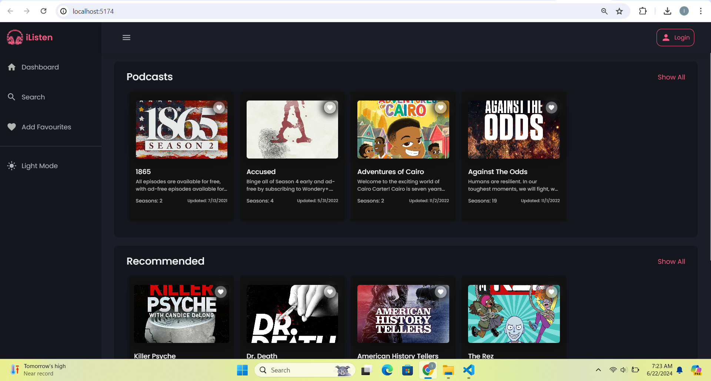
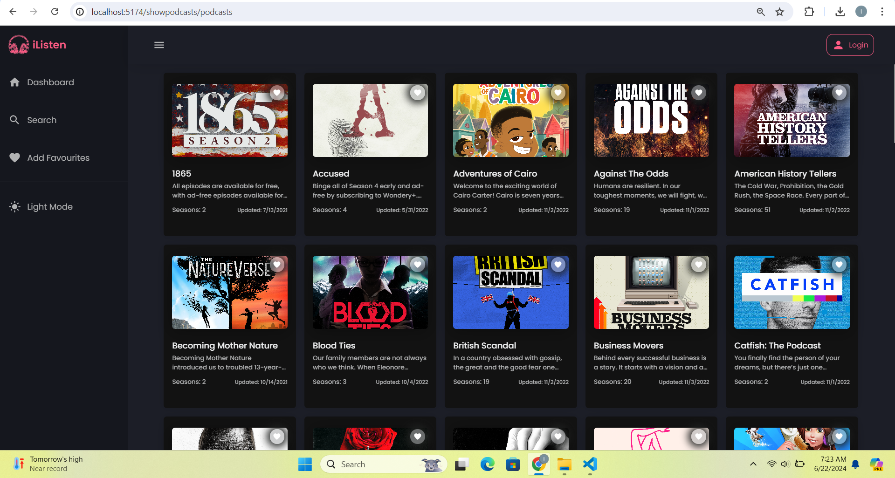
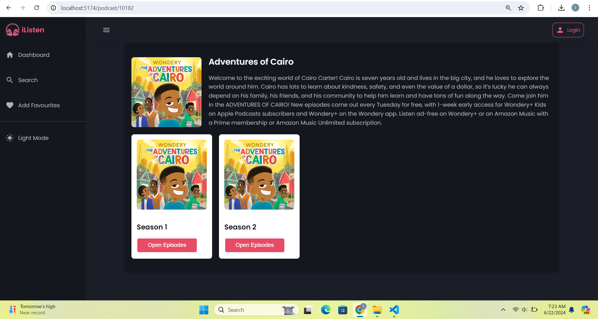
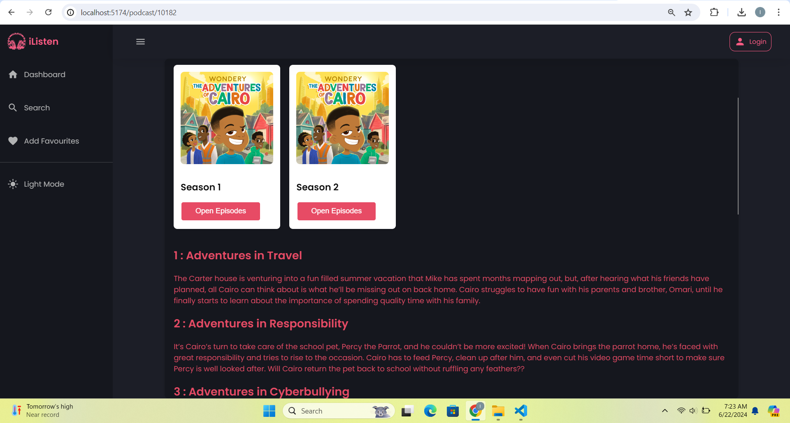
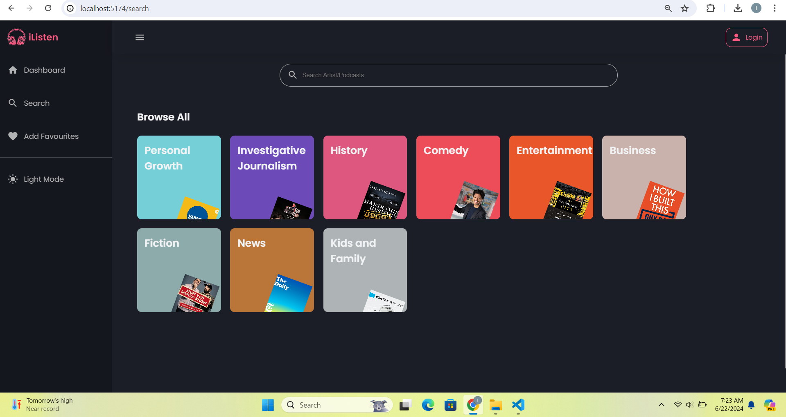
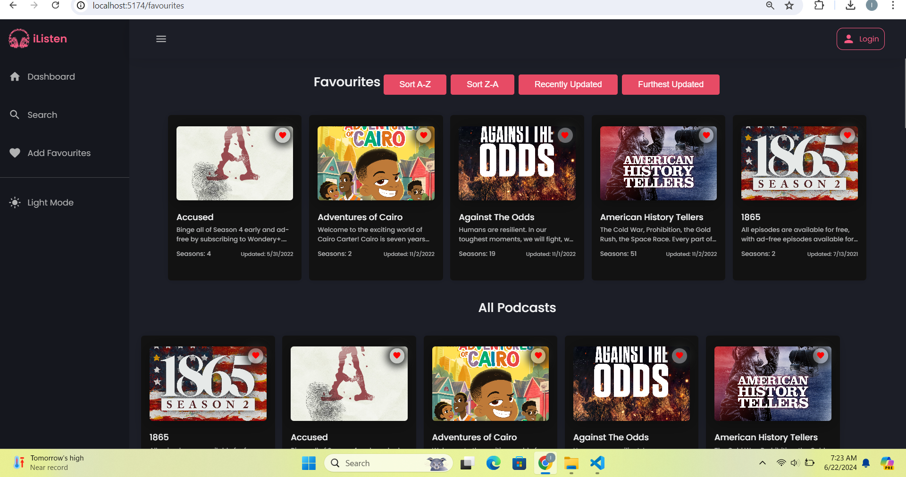
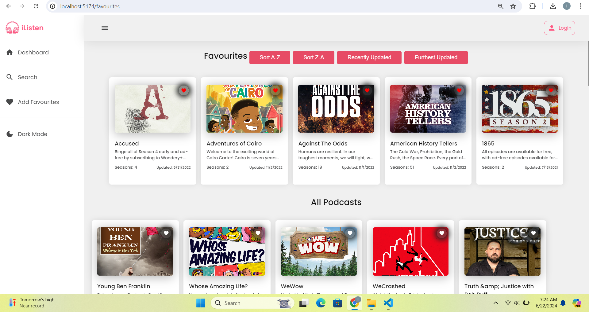

# 🎵 PODCAST APP | PORTFOLIO PIECE 💿
[DJS11] Starter Instructions for the Final Portfolio Piece Submission 🚀

## 🤖 Technology

**I completed this project using React and a build-process to manage all the complexity involved.** 

Other technologies included Javascript & CSS as well as React.

## Steps to start the app
- In your terminal, install dependecies by running `npm i` 
- Once installed, npm run dev & follow link

## Project showcase
### Dashboard
- User can see the names of available shows with preview images, the amount of seasons a show has, when the show was last updated, and only leads you to the episodes page when you're on the `/showpodcasts/podcasts` route. The appearance and desktop layout is well plannned. 
- The shows are sorted alphabetically.

### Seasons 
- User is able to see a view where seasons for a specific show is shown with it's data when the show episode button is clicked. They are also able to toggle between different seasons

### Search
- A search bar is present with different genres. Genre cards lead to the show Dashboard

### Favourites & Theme
- A favourites page is added which show different seasons a user can add. Seasons can be arranged frm A-Z, Z-A, recently updated and latest updated. Seasons can be added and removed from the favourites page.
- Extra feature included a theme toggle switch.

